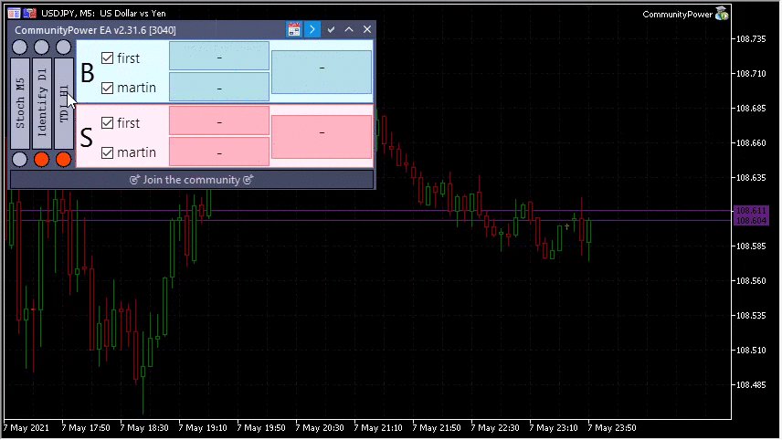

# How to attach indicators to the chart? Where can I get indicators?

While using MT5, just click on the signal label to switch the chart to the corresponding TF and show the indicator. Click again to hide the indicator:


   <h3><a href="{{ site.baseurl }}{{ post.url }}">{{ post.title }}</a></h3>

