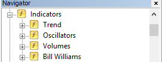

# How to attach indicators to the chart?

While using MT5, just click on the signal label to switch the chart to the corresponding TF and show the indicator. Click again to hide the indicator:

With MT4 you can't attach indicators automatically, so you should do it manually (remember to set the correct parameters!)

 

# Where can I get indicators?

Standard indicators like Stochastic or MACD are available in MetaTrader by default (see indicators sub-folders):

 

All non-standard indicators are available at the bottom of this page.

Download them to your hard drive, save to "Data folder\MQL4\Indicators\" ("Data folder\MQL5\Indicators\" for MT5) and restart your terminal. Data folder can be found using "File - Open data folder" command from the terminal menu.

 

##### AlexSTAL_ZigZagProf
[<button class="btn btn-success">for MT5</button>]({{site.baseurl}}/assets/Indicators/AlexSTAL_ZigZagProf.ex5)
[<button class="btn btn-primary">for MT4</button>]({{site.baseurl}}/assets/Indicators/AlexSTAL_ZigZagProf.ex4)

##### iDTrend
[<button class="btn btn-success">for MT5</button>]({{site.baseurl}}/assets/Indicators/iDTrend.ex5)
[<button class="btn btn-primary">for MT4</button>]({{site.baseurl}}/assets/Indicators/iDTrend.ex4)

##### iFrama
[<button class="btn btn-success">for MT5</button>]({{site.baseurl}}/assets/Indicators/iFrama.ex5)
[<button class="btn btn-primary">for MT4</button>]({{site.baseurl}}/assets/Indicators/iFrama.ex4)

##### iHMA
[<button class="btn btn-success">for MT5</button>]({{site.baseurl}}/assets/Indicators/iHMA.ex5)
[<button class="btn btn-primary">for MT4</button>]({{site.baseurl}}/assets/Indicators/iHMA.ex4)

##### iIdentifyTrend
[<button class="btn btn-success">for MT5</button>]({{site.baseurl}}/assets/Indicators/iIdentifyTrend.ex5)
[<button class="btn btn-primary">for MT4</button>]({{site.baseurl}}/assets/Indicators/iIdentifyTrend.ex4)

##### iJMA
[<button class="btn btn-success">for MT5</button>]({{site.baseurl}}/assets/Indicators/iJMA.ex5)
[<button class="btn btn-primary">for MT4</button>]({{site.baseurl}}/assets/Indicators/iJMA.ex4)

##### iMACD
[<button class="btn btn-success">for MT5</button>]({{site.baseurl}}/assets/Indicators/iMACD.ex5)
[<button class="btn btn-primary">for MT4</button>]({{site.baseurl}}/assets/Indicators/iMACD.ex4)

##### iTDI
[<button class="btn btn-success">for MT5</button>]({{site.baseurl}}/assets/Indicators/iTDI.ex5)
[<button class="btn btn-primary">for MT4</button>]({{site.baseurl}}/assets/Indicators/iTDI.ex4)

##### iTEMA
[<button class="btn btn-success">for MT5</button>]({{site.baseurl}}/assets/Indicators/iTEMA.ex5)
[<button class="btn btn-primary">for MT4</button>]({{site.baseurl}}/assets/Indicators/iTEMA.ex4)

##### iTMA
[<button class="btn btn-success">for MT5</button>]({{site.baseurl}}/assets/Indicators/iTMA.ex5)
[<button class="btn btn-primary">for MT4</button>]({{site.baseurl}}/assets/Indicators/iTMA.ex4)
